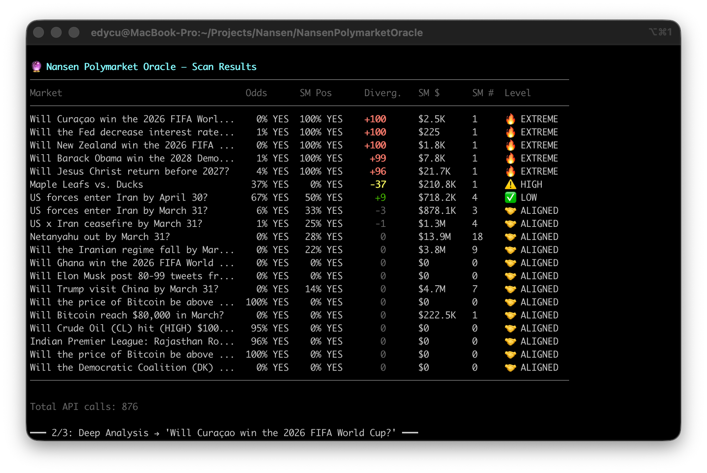
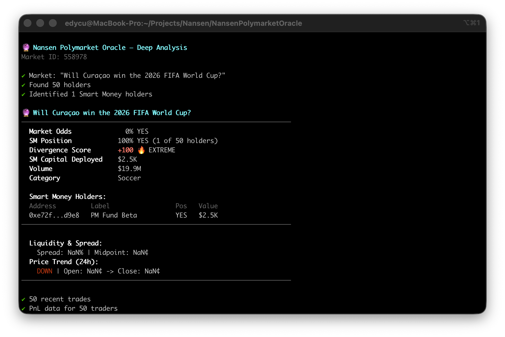
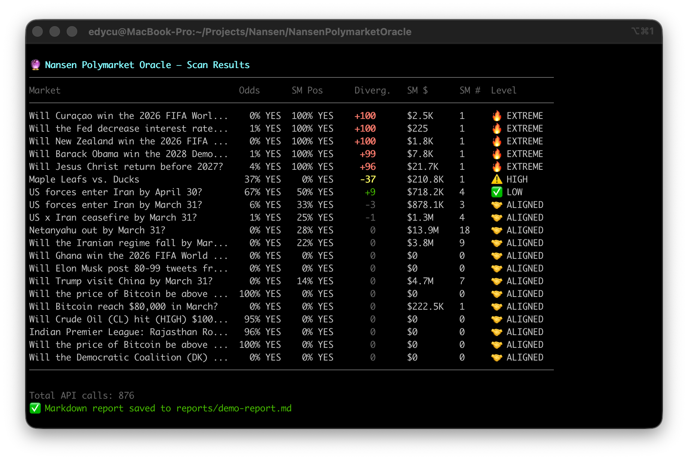
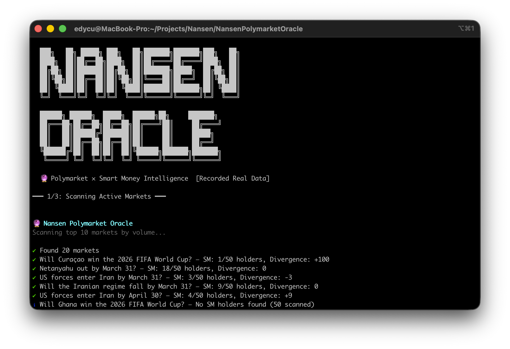
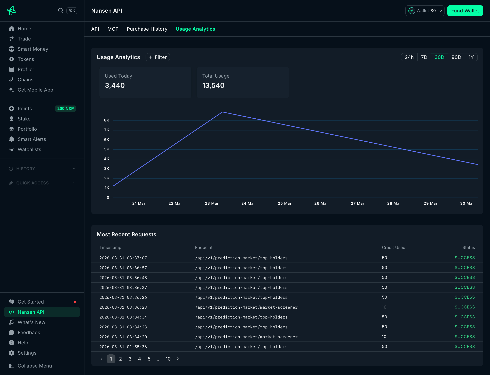

```
███╗   ██╗ █████╗ ███╗   ██╗███████╗███████╗███╗   ██╗
████╗  ██║██╔══██╗████╗  ██║██╔════╝██╔════╝████╗  ██║
██╔██╗ ██║███████║██╔██╗ ██║███████╗█████╗  ██╔██╗ ██║
██║╚██╗██║██╔══██║██║╚██╗██║╚════██║██╔══╝  ██║╚██╗██║
██║ ╚████║██║  ██║██║ ╚████║███████║███████╗██║ ╚████║
╚═╝  ╚═══╝╚═╝  ╚═╝╚═╝  ╚═══╝╚══════╝╚══════╝╚═╝  ╚═══╝

 ██████╗ ██████╗  █████╗  ██████╗██╗     ███████╗
██╔═══██╗██╔══██╗██╔══██╗██╔════╝██║     ██╔════╝
██║   ██║██████╔╝███████║██║     ██║     █████╗
██║   ██║██╔══██╗██╔══██║██║     ██║     ██╔══╝
╚██████╔╝██║  ██║██║  ██║╚██████╗███████╗███████╗
 ╚═════╝ ╚═╝  ╚═╝╚═╝  ╚═╝ ╚═════╝╚══════╝╚══════╝
```

### 🔮 Smart Money × Prediction Market Intelligence

> *"Don't bet against Smart Money. See what they see."*

Cross-reference on-chain whale positions with prediction market odds to identify mispriced outcomes.

🏆 **Built for [Nansen CLI Build Challenge — Week 3](https://x.com/nansen_ai)** • *Build Something Real*

<p align="center">
  
</p>

---

## 💡 The Problem

Prediction markets show crowd consensus. But the crowd is often wrong.

**Smart Money** — hedge funds, whale traders, and institutional wallets — frequently takes positions that diverge from the market. These hidden signals are buried in on-chain data that most traders never see.

## ⚡ The Solution

The Oracle surfaces one actionable insight: **"Where is Smart Money silently betting against the crowd?"**

```
Market Odds say:     12% YES on "Will Bitcoin hit $200K by June 2026?"
Smart Money says:    67% positioned on YES ($6.0M deployed)
Divergence:          🔥 +55 pts — SM is massively bullish vs. crowd
```

When Smart Money conviction diverges significantly from market odds, it signals a potential mispricing.

---

## 🎯 How It Works

### Core Pipeline: `scan` → `enrich` → `analyze`

```
┌─────────────────┐     ┌─────────────────┐     ┌─────────────────┐
│   1. SCAN       │     │   2. ENRICH     │     │   3. ANALYZE    │
│                 │     │                 │     │                 │
│ Fetch active    │────▶│ Cross-reference │────▶│ Calculate SM    │
│ prediction      │     │ holder wallets  │     │ Divergence      │
│ markets via     │     │ against Nansen  │     │ Score           │
│ Nansen CLI      │     │ profiler labels │     │ (-100 to +100)  │
└─────────────────┘     └─────────────────┘     └─────────────────┘
```

1. **Scan** — Fetches active prediction markets from Nansen CLI `research prediction-market` endpoints
2. **Enrich** — Cross-references holder addresses against Nansen's `profiler labels` to identify Smart Money wallets (Funds, Smart Traders, 90D Traders, etc.)
3. **Analyze** — Calculates a capital-weighted **SM Divergence Score** (-100 to +100):
   - **Positive** = SM is more bullish than market odds
   - **Negative** = SM is more bearish than market odds
   - Markets with |score| ≥ 40 are flagged as **🔥 EXTREME** alpha opportunities

### The SM Divergence Score

```typescript
// SM Divergence Score: -100 to +100
// Positive = SM more bullish than market
// Negative = SM more bearish than market

function calculateDivergence(smHolders, allHolders, marketOdds):
  1. Capital-weight each SM holder's position (YES = +weight, NO = -weight)
  2. Normalize weighted conviction from [-1, 1] to [0, 1]
  3. Divergence = (SM_conviction - market_odds) × 100
```

| Score | Level | Signal |
|-------|-------|--------|
| ±40+ | 🔥 EXTREME | SM strongly disagrees with market |
| ±25+ | ⚠️ HIGH | Notable divergence worth monitoring |
| ±10+ | 📊 MODERATE | Mild divergence |
| <±10 | ✅ LOW/🤝 ALIGNED | SM agrees with market consensus |

---

## 📸 Screenshots

### Scan — Market Discovery & Divergence Table
<p align="center">
  
</p>

### Analyze — Deep Market Intel
<p align="center">
  
</p>

### Report — Alpha Export
<p align="center">
  
</p>

---

## 🚀 Quick Start

### 1. Installation & Setup

```bash
# Install local dependencies
npm install

# Build and link the CLI globally
npm run build
npm link

# Install and configure Nansen CLI
npm install -g nansen-cli
nansen auth login
```

### 2. Run the Oracle

**🎬 Quick Demo (No API Key Required):**
```bash
bash demo.sh
```

<p align="center">
  
</p>

### Data Modes

| Mode | Command | Description |
|------|---------|-------------|
| 🔁 **Replay** (default) | `bash demo.sh` | Real recorded API data — no API key needed |
| 🧪 **Mock** | `bash demo.sh mock` | Synthetic data for development |
| 🔴 **Live** | `bash demo.sh live` | Live Nansen API (requires `nansen auth login`) |

```bash
# Replay mode — real recorded data, zero API calls
NANSEN_REPLAY=true nansen-oracle scan --limit 10

# Mock mode — synthetic test data
NANSEN_MOCK=true nansen-oracle scan --limit 8

# Live mode — real-time API (default when no env var is set)
nansen-oracle scan

# Record mode — capture live API responses for replay
NANSEN_RECORD=true nansen-oracle scan --limit 5
```

> 💡 **`nansen-record.log`** contains captured responses from a real Nansen API session — real markets, real whale addresses — without consuming API credits. Generate your own with `NANSEN_RECORD=true`.

---

## 🛠️ Commands

| Command | Description |
|---------|-------------|
| `scan` | Discover prediction markets ranked by SM divergence |
| `analyze <id>` | Deep analysis of a specific market: holders, trades, PnL |
| `report` | Full alpha report exported as Markdown or JSON |
| `watch <id>` | Live monitoring with Smart Money position change alerts |
| `address <addr>` | Wallet-level SM lookup: labels, PnL, recent trades |

<details>
<summary><strong>CLI Options</strong></summary>

```
scan:
  -c, --category <cat>     Filter by market category
  -v, --min-volume <usd>   Minimum volume (default: 10000)
  -l, --limit <n>          Markets to scan (default: 20)
  --chain <chain>          Chain for profiler (default: ethereum)

analyze:
  --chain <chain>          Chain for profiler (default: ethereum)

report:
  -f, --format <fmt>       Output: md, json, table (default: md)
  -o, --output <path>      File path for report
  -l, --limit <n>          Markets to include (default: 20)

watch:
  -i, --interval <secs>    Refresh interval in seconds (default: 60)
  --chain <chain>          Chain for profiler (default: ethereum)
```

</details>

---

## 🏗️ Architecture

```
src/
├── index.ts              # CLI entrypoint (Commander.js)
├── commands/
│   ├── scan.ts           # Market discovery + enrichment
│   ├── analyze.ts        # Single market deep-dive
│   ├── report.ts         # Full report generation
│   ├── watch.ts          # Real-time monitoring
│   └── address.ts        # Wallet-level SM lookup
├── lib/
│   ├── nansen.ts         # CLI wrapper (exec → JSON)
│   ├── enricher.ts       # SM label cross-referencing
│   ├── analyzer.ts       # Divergence score algorithm
│   ├── cache.ts          # TTL cache for label lookups
│   ├── formatter.ts      # Terminal + Markdown output
│   ├── known-wallets.ts  # Known SM wallet registry
│   ├── mock.ts           # Mock data generator
│   └── replay.ts         # API response replay engine
└── types/
    ├── market.ts          # Prediction market types
    ├── smartmoney.ts      # SM labels + enriched holders
    └── report.ts          # Analysis output types
```

---

## 📡 Nansen CLI Endpoints Used (15+)

<p align="center">
  
</p>

| # | Endpoint | Purpose |
|---|----------|---------|
| 1 | `research prediction-market market-screener` | Discover active markets |
| 2 | `research prediction-market event-screener` | Event-level overview |
| 3 | `research prediction-market top-holders` | Who holds positions |
| 4 | `research prediction-market trades-by-market` | Trading activity |
| 5 | `research prediction-market pnl-by-market` | PnL leaderboard |
| 6 | `research prediction-market ohlcv` | Price history |
| 7 | `research prediction-market orderbook` | Liquidity depth |
| 8 | `research profiler labels` | Wallet classification |
| 9 | `research profiler pnl-summary` | Wallet performance |
| 10 | `research smart-money netflow` | Cross-chain flow context |
| 11 | `research token info` | Related token context |
| 12 | `research prediction-market pnl-by-address` | SM prediction accuracy |
| 13 | `research prediction-market trades-by-address` | SM trading patterns |
| 14 | `research prediction-market categories` | Market categorization |
| 15 | `research prediction-market position-detail` | Position breakdown |

---

## ✅ Testing

**128 tests · 13 suites · 100% coverage**

```bash
# Run all tests
npm test

# Run with coverage enforcement (100% threshold)
npm run test:coverage
```

```
 % Coverage report from v8
-------------------|---------|----------|---------|---------|
File               | % Stmts | % Branch | % Funcs | % Lines |
-------------------|---------|----------|---------|---------|
All files          |     100 |      100 |     100 |     100 |
-------------------|---------|----------|---------|---------|
```

<details>
<summary><strong>What's tested</strong></summary>

- **Divergence algorithm** — capital-weighting, edge cases, score bounds
- **SM enrichment** — label matching, batch processing, fallback logic
- **TTL cache** — expiry, invalidation, capacity
- **Mock/Replay engines** — data fidelity, command routing
- **All CLI commands** — scan, analyze, report, watch, address
- **Error handling** — network failures, malformed data, graceful degradation

</details>

---

## 🏆 Challenge Criteria

| Criteria | How Oracle Delivers |
|----------|---------------------|
| **Creativity** | First prediction market × Smart Money cross-reference tool |
| **Usefulness** | Directly actionable: "SM says this market is mispriced, here's why" |
| **Technical Depth** | 15+ endpoints, cross-referencing, divergence algorithm, 100% test coverage |
| **Presentation** | Output IS the pitch — "SM bets $7.9M that BTC hits $200K" |

---

<p align="center">
  📊 Data by <a href="https://nansen.ai">Nansen</a> · <code>#NansenCLI</code> · <code>@nansen_ai</code>
</p>
